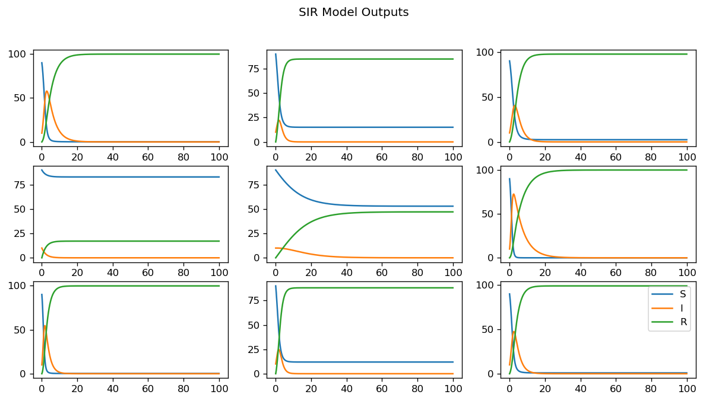

# Data generation: SIR model

On this notebook we will generate data from the SIR model (add reference) using summer library (https://summer.readthedocs.io/)

## Data Generation


```python
# Simulation libraries
import numpy as np
from summer import CompartmentalModel

# Numpy random seed
np.random.seed(42)

# Number of simulations
n_sim = 100000

# Beta: contact rate
beta_sim =  np.random.uniform(0.1, 3, n_sim) # Search for info to argument this
# Gamma: mean recovery rate
gamma_sim = np.random.uniform(0.1, 1, n_sim) # Serarch for info to argument this

# Function for creating model and running each simulation
def create_run_model(beta, gamma):
    # Create a model.
    model = CompartmentalModel(
        times=[0, 100], # Units of time: days
        compartments=["S", "I", "R"],
        infectious_compartments=["I"],
        timestep=0.1,
    )

    # Add people to the model.
    model.set_initial_population(distribution={"S": 90, "I": 10})

    # Add intercompartmental flows.
    model.add_infection_frequency_flow(name="infection", contact_rate=beta, source="S", dest="I")
    model.add_transition_flow(name="recovery", fractional_rate=gamma, source="I", dest="R")

    # Run the model
    model.run()
    
    # Outputs
    return model.outputs, model.times, np.array([beta, gamma])


```

## Data simulation

Data is saved on `data_sim` variable. `data_sim` includes
- data_sim[0] = model.outputs; Outputs simulation from each compartment
- data_sim[1] = model.times; time used on simulation
- data_sim[2] = [beta, gamma]; Contact rate (beta) and Recovery rate (gamma) used on sim.


```python
from tqdm import trange
data_sim = []
for i in trange(n_sim):
    data_sim.append(create_run_model(beta=beta_sim[i], gamma=gamma_sim[i]))

```

      0%|          | 57/100000 [00:01<53:17, 31.26it/s]


    ---------------------------------------------------------------------------

    KeyboardInterrupt                         Traceback (most recent call last)

    Cell In[13], line 4
          2 data_sim = []
          3 for i in trange(n_sim):
    ----> 4     data_sim.append(create_run_model(beta=beta_sim[i], gamma=gamma_sim[i]))


    Cell In[12], line 34, in create_run_model(beta, gamma)
         31 model.add_transition_flow(name="recovery", fractional_rate=gamma, source="I", dest="R")
         33 # Run the model
    ---> 34 model.run()
         36 # Outputs
         37 return model.outputs, model.times, np.array([beta, gamma])


    File ~/miniforge3/envs/SIR-ML/lib/python3.10/site-packages/summer/model.py:887, in CompartmentalModel.run(self, solver, backend, backend_args, parameters, **kwargs)
        884 self.outputs[self.outputs < 0.0] = 0.0
        886 # Calculate any requested derived outputs, based on the calculated compartment sizes.
    --> 887 self.derived_outputs, self._derived_outputs_idx_cache = self._calculate_derived_outputs()
        888 return self


    File ~/miniforge3/envs/SIR-ML/lib/python3.10/site-packages/summer/model.py:1055, in CompartmentalModel._calculate_derived_outputs(self)
       1054 def _calculate_derived_outputs(self):
    -> 1055     return calculate_derived_outputs(
       1056         requests=self._derived_output_requests,
       1057         graph=self._derived_output_graph,
       1058         outputs=self.outputs,
       1059         times=self.times,
       1060         timestep=self.timestep,
       1061         flows=self._flows,
       1062         compartments=self.compartments,
       1063         get_flow_rates=self._backend.get_flow_rates,
       1064         model=self,
       1065         whitelist=self._derived_outputs_whitelist,
       1066         baseline=self._baseline,
       1067         idx_cache=self._derived_outputs_idx_cache,
       1068         parameters=self._backend.parameters,
       1069     )


    File ~/miniforge3/envs/SIR-ML/lib/python3.10/site-packages/summer/derived_outputs.py:108, in calculate_derived_outputs(requests, graph, outputs, times, timestep, flows, compartments, get_flow_rates, model, whitelist, baseline, idx_cache, parameters)
        102 # FIXME: Another question for Matt - has my changes to the time requests stuffed this up?
        103 # Because the timestep for the last time interval can now be different from the earlier ones.
        104 # So do we need to assert that the duration is an exact multiple of the timestep?
        105 # Could cause silent problems, because presumably we have previously been specifying durations as multiples of the timestep.
        106 for time_idx, time in enumerate(times):
        107     # Flow rates are instantaneous; we need to provide an integrated value over timestep
    --> 108     flow_rates = get_flow_rates(outputs[time_idx], time)
        109     flow_values[time_idx, :] = flow_rates * timestep
        110     # Collect these as lists then build DataFrames afterwards


    File ~/miniforge3/envs/SIR-ML/lib/python3.10/site-packages/summer/runner/vectorized_runner.py:353, in VectorizedRunner.get_flow_rates(self, compartment_values, time)
        348 """
        349 Returns the contribution of each flow to compartment rate of change for a given state and
        350 time.
        351 """
        352 comp_vals = self._clean_compartment_values(compartment_values)
    --> 353 _, flow_rates = self._get_rates(comp_vals, time)
        354 return flow_rates


    File ~/miniforge3/envs/SIR-ML/lib/python3.10/site-packages/summer/runner/vectorized_runner.py:324, in VectorizedRunner._get_rates(self, comp_vals, time)
        310 def _get_rates(self, comp_vals: np.ndarray, time: float) -> Tuple[np.ndarray, np.ndarray]:
        311     """Calculates inter-compartmental flow rates for a given state and time, as well
        312     as the updated compartment values once these rate deltas have been applied
        313 
       (...)
        322             flow_rates is the contribution of each flow to compartment rate of change
        323     """
    --> 324     self._prepare_time_step(time, comp_vals)
        326     comp_rates = np.zeros(len(comp_vals))
        327     flow_rates = self._get_flow_rates(comp_vals, time)


    File ~/miniforge3/envs/SIR-ML/lib/python3.10/site-packages/summer/runner/vectorized_runner.py:153, in VectorizedRunner._prepare_time_step(self, time, compartment_values)
        150 # Find the effective infectious population for the force of infection (FoI) calculations.
        151 mixing_matrix = self._get_mixing_matrix(time)
    --> 153 self._calculate_strain_infection_values(compartment_values, mixing_matrix)


    File ~/miniforge3/envs/SIR-ML/lib/python3.10/site-packages/summer/runner/vectorized_runner.py:255, in VectorizedRunner._calculate_strain_infection_values(self, compartment_values, mixing_matrix)
        252 self._infection_density_flat[strain_idx] = infection_density
        254 self._infection_frequency[strain] = infection_frequency
    --> 255 self._infection_frequency_flat[strain_idx] = infection_frequency


    KeyboardInterrupt: 


## Save Data

Data is saved from `data_sim` variable as a numpy file.


```python
import pickle

# Save Path
data_path = '../../data/raw/simulated/SIR'

# Saving data
with open(f'{data_path}/sir.pkl', 'wb') as f:
    pickle.dump(data_sim, f)
```

## Load data (test)


```python
# Load Path
data_path = '../../data/raw/simulated/SIR'
with open(f'{data_path}/sir.pkl', 'rb') as f:
    data_sim_test = pickle.load(f) 
```

## Plot examples


```python
import matplotlib.pyplot as plt

n_sim = len(data_sim_test)
n_plot = np.random.randint(n_sim, size=9)
# Plot the model results.
fig = plt.figure(dpi=120, figsize=(12,6))

for n, n_sim in enumerate(n_plot):
    ax = fig.add_subplot(3,3, n + 1)
    for i in range(data_sim_test[n_sim][0].shape[1]):
        ax.plot(data_sim_test[n_sim][1], data_sim_test[n_sim][0].T[i])    


fig.suptitle(f"SIR Model Outputs")
plt.legend(["S", "I", "R"])
plt.show()
```


    

    

